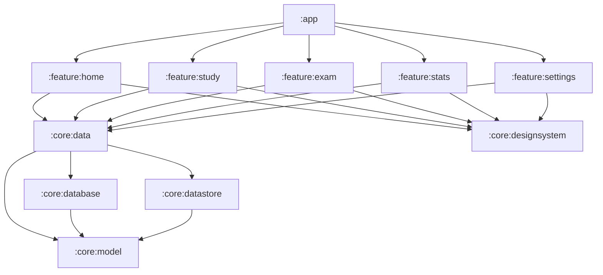

# SIE Exam Prep Android App

[](https://kotlinlang.org)
[](https://developer.android.com/jetpack/compose)
[](LICENSE)

## 📖 Project Background & Objectives / 项目背景与目标

**English:**
The SIE Exam Prep Android App is a comprehensive mobile application designed to assist candidates in preparing for the Securities Industry Essentials (SIE) exam. The primary objective is to provide a focused, distraction-free study environment with realistic exam simulations.

**Objectives:**
- **Core Focus:** Deliver essential study and exam simulation features without unnecessary social distractions.
- **Modern Tech:** Built entirely with Native Android (Kotlin) and Jetpack Compose to ensure high performance and adherence to modern Android development standards.
- **Maintainability:** utilize a multi-module architecture to support scalability and ease of maintenance.

**中文:**
SIE Exam Prep Android App 是一款专为证券行业基础考试 (SIE) 考生设计的综合性移动应用。主要目标是提供一个专注、无干扰的学习环境和真实的模拟考试体验。

**项目目标:**
- **核心聚焦:** 提供核心学习和模拟考试功能，摒弃不必要的社交干扰。
- **现代技术:** 完全使用原生 Android (Kotlin) 和 Jetpack Compose 构建，确保高性能并符合现代 Android 开发标准。
- **可维护性:** 采用多模块架构，支持扩展性和易于维护。

---

## 🏗 System Architecture / 系统架构

### Architecture Diagram / 架构图



### Core Modules / 核心模块说明

| Module / 模块 | Description / 说明 |
| :--- | :--- |
| **:app** | The application entry point, dependency injection setup (Hilt), and navigation host. <br> 应用入口，依赖注入配置 (Hilt) 和导航宿主。 |
| **:core:data** | Repository layer handling data operations and business logic. <br> 处理数据操作和业务逻辑的仓库层。 |
| **:core:database** | Local database implementation using Room. Pre-populated with exam questions. <br> 使用 Room 的本地数据库实现。预置考试题目。 |
| **:core:datastore** | Lightweight data storage for user preferences (Proto DataStore). <br> 用于用户偏好设置的轻量级数据存储 (Proto DataStore)。 |
| **:core:designsystem** | Reusable UI components, themes, and icons based on Material Design 3. <br> 基于 Material Design 3 的可复用 UI 组件、主题和图标。 |
| **:core:model** | Domain models shared across the application. <br> 跨应用共享的领域模型。 |
| **:feature:*** | Feature-specific modules containing UI screens and ViewModels (e.g., Exam, Study, Stats). <br> 包含 UI 界面和 ViewModel 的功能模块（如考试、学习、统计）。 |

---

## 🛠 Local Development Setup / 本地开发环境搭建

### Prerequisites / 前置要求

- **JDK**: Java 17 (Recommended for Android Gradle Plugin 8.2.0+)
- **Android Studio**: Hedgehog (2023.1.1) or newer
- **Android SDK**: API 34 (UpsideDownCake)

### Installation Steps / 安装步骤

1.  **Clone the repository / 克隆仓库:**
    ```bash
    git clone https://github.com/your-username/sie-android-app.git
    cd sie-android-app
    ```

2.  **Environment Variables / 环境变量:**
    - Ensure `ANDROID_HOME` is set in your environment or `sdk.dir` is defined in `local.properties`.
    - No API keys are required for the core functionality as it runs offline.
    - 确保 `ANDROID_HOME` 已设置，或在 `local.properties` 中定义了 `sdk.dir`。核心功能离线运行，无需 API 密钥。

3.  **Database Initialization / 数据库初始化:**
    - The database is automatically populated from `core/database/src/main/assets/questions.json` on the first run. No manual script execution is required.
    - 数据库会在首次运行时自动从 `core/database/src/main/assets/questions.json` 填充。无需手动执行脚本。

4.  **Build the project / 构建项目:**
    ```bash
    ./gradlew assembleDebug
    ```

### Dependency Versions / 依赖版本

- **Kotlin**: 1.9.20
- **Jetpack Compose**: 1.6.0
- **Hilt**: 2.50
- **Room**: 2.6.1

---

## 🧪 Testing / 测试

### Unit & Integration Tests / 单元与集成测试

Run the following commands to execute tests:
运行以下命令执行测试：

- **Unit Tests (Local JVM) / 单元测试:**
    ```bash
    ./gradlew testDebugUnitTest
    ```
- **Integration Tests (Instrumented) / 集成测试:**
    ```bash
    ./gradlew connectedAndroidTest
    ```

### Coverage Requirements / 覆盖率要求

- **Target / 目标:** ≥ 80% Code Coverage for business logic (Repositories, ViewModels, UseCases).
- **Report Generation / 生成报告:**
    To generate the coverage report (requires Jacoco configuration):
    若要生成覆盖率报告（需配置 Jacoco）：
    ```bash
    ./gradlew jacocoTestReport
    ```
    Report location: `app/build/reports/jacoco/test/html/index.html`

---

## ❓ Troubleshooting / 常见问题排障表

| Issue / 问题 | Possible Cause / 可能原因 | Solution / 解决方案 |
| :--- | :--- | :--- |
| **Gradle Sync Failed** | Incompatible JDK version. <br> JDK 版本不兼容。 | Ensure you are using JDK 17. Check Project Structure settings. <br> 确保使用 JDK 17。检查项目结构设置。 |
| **"Compose Compiler" Error** | Kotlin version mismatch. <br> Kotlin 版本不匹配。 | Verify `kotlinCompilerExtensionVersion` in `build.gradle.kts` matches your Kotlin version. <br> 验证 `build.gradle.kts` 中的 `kotlinCompilerExtensionVersion` 与 Kotlin 版本匹配。 |
| **Database Empty** | Asset file missing or corrupted. <br> 资源文件丢失或损坏。 | Check `core/database/src/main/assets/questions.json` exists and is valid JSON. Clear app data to trigger re-population. <br> 检查 `questions.json` 是否存在且格式正确。清除应用数据以触发重新填充。 |
| **Emulator Performance** | HAXM/AEHD not installed. <br> 未安装 HAXM/AEHD。 | Install Hardware Accelerator via Android SDK Manager. <br> 通过 Android SDK 管理器安装硬件加速器。 |

---

## 📄 License & Copyright / 许可证与版权信息

This project is licensed under the MIT License. See the [LICENSE](LICENSE) file for details.
本项目采用 MIT 许可证。详情请参阅 [LICENSE](LICENSE) 文件。

Copyright © 2026 SIE Exam Prep Team.

---

## 📅 Changelog / 更新日志

See [CHANGELOG.md](CHANGELOG.md) for the full history of changes.
查看 [CHANGELOG.md](CHANGELOG.md) 获取完整变更历史。

---

> **Note**: To generate the documentation site locally, run:
> **注意**: 要在本地生成文档站点，请运行：
> ```bash
> make docs
> ```
